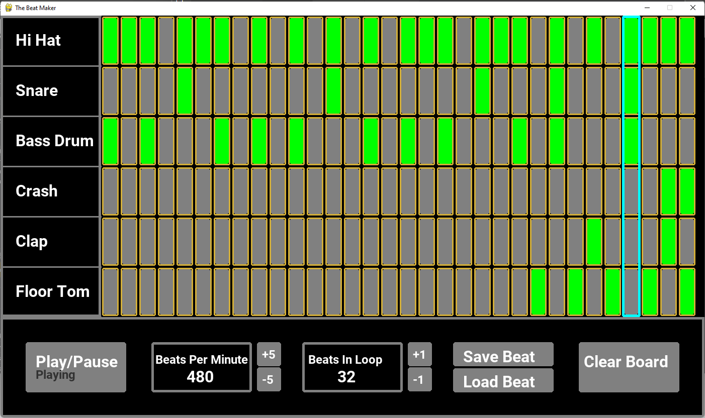

# Drum kit machine / Beat maker With Pygame.

Python & Pygame drum kit machine / beat maker.



## Usage


Install the dependencies

```bash
pipenv install -r requirements.txt || python install -r requirements.txt
```

Run server

```bash
python main.py
```